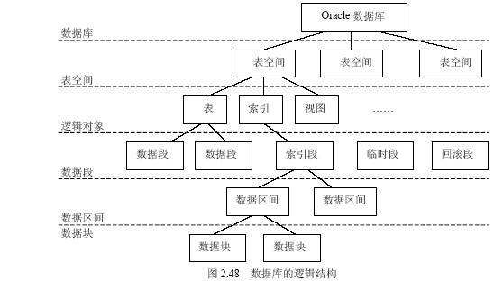

# Oracle 体系结构

## 1. 数据库

Oracle 数据库是数据的物理存储。这就包括数据文件 ORA 或者 DBF、控制文件，联机日志、参数文件。Oracle 数据库和其它数据库不一样，这里的数据库是一个操作系统只有一个库，可以看做 Oracle 只有一个大数据库

## 2. 实例

由内存区和后台进程组成

1. 内存区：数据库高速缓存、重做日志缓存、共享池、流池以及其它可选内存区（如Java池），这些池也称为数据库的内存结构

2. 后台进程：包括系统监控进程（SMON）、进程监控（PMON）、数据库写进程（DBWR）、日志写进程（LGWR）、检验点进程（CKPT）、其它进程（SMON，如归档进程、RECO进程等）

3. 注：要访问数据库必须先启动实例，实例启动时先分配内存区，然后再启动后台进程，后台进程执行库数据的输入、输出以及监控其它Oracle进程。在数据库启动过程中有五个进程是必须启动的，它们是系统监控进程（SMON）、进程监控（PMON）、数据库写进程（DBWR）、日志写进程（LGWR）、检验点进程（CKPT），否则实例无法创建。

## 3. 物理结构

### 数据文件（dbf）

数据文件是数据库的物理存储单位。数据库的数据是存储在表空间中的，而一个表空间可以由一个或多个数据文件组成。

一个数据文件只能属于一个表空间，一旦数据文件被加入到某个表空间后，就不能删除这个文件，如果要删除某个数据文件，只能删除其所属的表空间才可以。

每一个 Oracle 数据库有一个或多个物理的数据文件(data file)。一个数据库的数据文件包含全部数据库数据。逻辑数据库结构(如表、索引)的数据物理地存储在数据库的数据文件中。数据文件有下列特征： 

* 一个数据文件仅与一个数据库联系。

* 一旦建立，数据文件不能改变大小.

* 一个表空间（数据库存储的逻辑单位）由一个或多个数据文件组成。 

数据文件中的数据在需要时可以读取并存储在ORACLE内存储区中。例如：用户要存取数据库一表的某些数据，如果请求信息不在数据库的内存存储区内，则从相应的数据文件中读取并存储在内存。当修改和插入新数据时，不必立刻写入数据文件。为了减少磁盘输出的总数，提高性能，数据存储在内存，然后由ORACLE后台进程DBWR决定如何将其写入到相应的数据文件

### 控制文件

每一个 Oracle 数据库有一个控制文件（control file），它记录数据库的物理结构，包含下列信息类型： 

* 数据库名； 
* 数据库数据文件和日志文件的名字和位置； 
* 数据库建立日期。 

为了安全起见，允许控制文件被镜像。 

每一次ORACLE数据库的实例启动时，它的控制文件用于标识数据库和日志文件，当着手数据库操作时它们必须被打开。当数据库的物理组成更改时，ORACLE自动更改该数据库的控制文件。数据恢复时，也要使用控制文件。

### 日志文件

每一个数据库有两个或多个日志文件（redo log file）的组，每一个日志文件组用于收集数据库日志。日志的主要功能是记录对数据所作的修改，所以对数据库作的全部修改是记录在日志中。在出现故障时，如果不能将修改数据永久地写入数据文件，则可利用日志得到该修改，所以从不会丢失已有操作成果。 

日志文件主要是保护数据库以防止故障。为了防止日志文件本身的故障，Oracle 允许镜像日志(mirrored redo log)，以致可在不同磁盘上维护两个或多个日志副本。 

日志文件中的信息仅在系统故障或介质故障恢复数据库时使用，这些故障阻止将数据库数据写入到数据库的数据文件。然而任何丢失的数据在下一次数据库打开时，ORACLE自动地应用日志文件中的信息来恢复数据库数据文件

### 参数文件

除了构成Oracle数据库物理结构的三类主要文件外，Oracle 数据库还具有另外一种重要的文件：参数文件。参数文件记录了 Oracle 数据库的基本参数信息，主要包括数据库名、控制文件所在路径、进程等。与旧版本的初始化参数文件 INITsid.ora 不同，在 Oracle10g 中还可以使用二进进制服务器参数文件，并且该服务器参数文件在安装Oracle数据库系统时由系统自动创建，文件的名称为SPFILEsid.ora，sid为所创建的数据库实例名。 

SPFILEsid.ora 中的参数是由 Oracle 系统自动管理。如果想要对数据库的某些参数进行设置，则可能过 OEM 或 ALTER SYSTEM 命令来修改。用户最好不要用编辑器进行修改

## 4. 表空间

**是数据库的逻辑划分。**任何数据库对象在存储时都必须存储在某个表空间中。表空间对应于若干个磁盘文件，即表空间是由一个或多个磁盘文件构成的。表空间相当于操作系统中的文件夹，也是数据库逻辑结构与物理文件之间的一个映射。每个数据库至少有一个表空间（system tablespace），表空间的大小等于所有从属于它的数据文件大小的总和。

### 系统表空间（system tablespace）

是每个Oracle数据库都必须具备的。其功能是在系统表空间中存放诸如表空间名称、表空间所含数据文件等数据库管理所需的信息。系统表空间的名称是不可更改的。系统表空间必须在任何时候都可以用，也是数据库运行的必要条件。因此，系统表空间是不能脱机的。 
系统表空间包括数据字典、存储过程、触发器和系统回滚段。为避免系统表空间产生存储碎片以及争用系统资源的问题，应创建一个独立的表空间用来单独存储用户数据。

### SYSAUX 表空间

是随着数据库的创建而创建的，它充当 SYSTEM 的辅助表空间，主要存储除数据字典以外的其他对象。SYSAUX 也是许多 Oracle 数据库的默认表空间，它减少了由数据库和DBA管理的表空间数量，降低了 SYSTEM 表空间的负荷。

### 临时表空间

相对于其他表空间而言，临时表空间（temp tablespace）主要用于存储 Oracle 数据库运行期间所产生的临时数据。数据库可以建立多个临时表空间。当数据库关闭后，临时表空间中所有数据将全部被清除。除临时表空间外，其他表空间都属于永久性表空间。

### 撤销表空间

用于保存Oracle数据库撤销信息，即保存用户回滚段的表空间称之为回滚表空间（或简称为RBS撤销表空间（undo tablespace））。在Oracle8i中是 rollback tablespace，从Oracle9i 开始改为 undo tablespace。在Oracle 10g中初始创建的只有6个表空间 sysaux、system、temp、undotbs1、example和users。其中 temp 是临时表空间，undotbs1 是 undo 撤销表空间。

### USERS 表空间

用户表空间，用于存放永久性用户对象的数据和私有信息。每个数据块都应该有一个用户表空间，以便在创建用户是将其分配给用户

## 5. 用户

用户是在表空间下建立的。用户登录后只能看到和操作自己的表，Oracle 的用户与 MySQL 的数据库类似，每建立一个应用需要创建一个用户