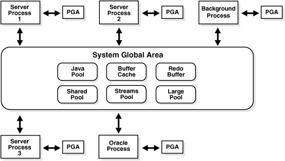

# Oracle 体系结构


## 1. 数据库

Oracle 数据库是数据的物理存储。这就包括数据文件 ORA 或者 DBF、控制文件，联机日志、参数文件。Oracle 数据库和其它数据库不一样，这里的数据库是一个操作系统只有一个库，可以看做 Oracle 只有一个大数据库

## 2. 实例

由内存区和后台进程组成

1. 内存区：数据库高速缓存、重做日志缓存、共享池、流池以及其它可选内存区（如Java池），这些池也称为数据库的内存结构

2. 后台进程：包括系统监控进程（SMON）、进程监控（PMON）、数据库写进程（DBWR）、日志写进程（LGWR）、检验点进程（CKPT）、其它进程（SMON，如归档进程、RECO进程等）

3. 注：要访问数据库必须先启动实例，实例启动时先分配内存区，然后再启动后台进程，后台进程执行库数据的输入、输出以及监控其它Oracle进程。在数据库启动过程中有五个进程是必须启动的，它们是系统监控进程（SMON）、进程监控（PMON）、数据库写进程（DBWR）、日志写进程（LGWR）、检验点进程（CKPT），否则实例无法创建。

## 3. 物理结构

### 数据文件（dbf）

数据文件是数据库的物理存储单位。数据库的数据是存储在表空间中的，而一个表空间可以由一个或多个数据文件组成。

一个数据文件只能属于一个表空间，一旦数据文件被加入到某个表空间后，就不能删除这个文件，如果要删除某个数据文件，只能删除其所属的表空间才可以。

每一个 Oracle 数据库有一个或多个物理的数据文件(data file)。一个数据库的数据文件包含全部数据库数据。逻辑数据库结构(如表、索引)的数据物理地存储在数据库的数据文件中。数据文件有下列特征： 

* 一个数据文件仅与一个数据库联系。

* 一旦建立，数据文件不能改变大小.

* 一个表空间（数据库存储的逻辑单位）由一个或多个数据文件组成。 

数据文件中的数据在需要时可以读取并存储在ORACLE内存储区中。例如：用户要存取数据库一表的某些数据，如果请求信息不在数据库的内存存储区内，则从相应的数据文件中读取并存储在内存。当修改和插入新数据时，不必立刻写入数据文件。为了减少磁盘输出的总数，提高性能，数据存储在内存，然后由ORACLE后台进程DBWR决定如何将其写入到相应的数据文件

### 控制文件

每一个 Oracle 数据库有一个控制文件（control file），它记录数据库的物理结构，包含下列信息类型： 

* 数据库名； 
* 数据库数据文件和日志文件的名字和位置； 
* 数据库建立日期。 

为了安全起见，允许控制文件被镜像。 

每一次ORACLE数据库的实例启动时，它的控制文件用于标识数据库和日志文件，当着手数据库操作时它们必须被打开。当数据库的物理组成更改时，ORACLE自动更改该数据库的控制文件。数据恢复时，也要使用控制文件。

### 日志文件

每一个数据库有两个或多个日志文件（redo log file）的组，每一个日志文件组用于收集数据库日志。日志的主要功能是记录对数据所作的修改，所以对数据库作的全部修改是记录在日志中。在出现故障时，如果不能将修改数据永久地写入数据文件，则可利用日志得到该修改，所以从不会丢失已有操作成果。 

日志文件主要是保护数据库以防止故障。为了防止日志文件本身的故障，Oracle 允许镜像日志(mirrored redo log)，以致可在不同磁盘上维护两个或多个日志副本。 

日志文件中的信息仅在系统故障或介质故障恢复数据库时使用，这些故障阻止将数据库数据写入到数据库的数据文件。然而任何丢失的数据在下一次数据库打开时，ORACLE自动地应用日志文件中的信息来恢复数据库数据文件

### 参数文件

除了构成Oracle数据库物理结构的三类主要文件外，Oracle 数据库还具有另外一种重要的文件：参数文件。参数文件记录了 Oracle 数据库的基本参数信息，主要包括数据库名、控制文件所在路径、进程等。与旧版本的初始化参数文件 INITsid.ora 不同，在 Oracle10g 中还可以使用二进进制服务器参数文件，并且该服务器参数文件在安装Oracle数据库系统时由系统自动创建，文件的名称为SPFILEsid.ora，sid为所创建的数据库实例名。 

SPFILEsid.ora 中的参数是由 Oracle 系统自动管理。如果想要对数据库的某些参数进行设置，则可能过 OEM 或 ALTER SYSTEM 命令来修改。用户最好不要用编辑器进行修改

## 4. 表空间

**是数据库的逻辑划分。**任何数据库对象在存储时都必须存储在某个表空间中。表空间对应于若干个磁盘文件，即表空间是由一个或多个磁盘文件构成的。表空间相当于操作系统中的文件夹，也是数据库逻辑结构与物理文件之间的一个映射。每个数据库至少有一个表空间（system tablespace），表空间的大小等于所有从属于它的数据文件大小的总和。

### 系统表空间（system tablespace）

是每个Oracle数据库都必须具备的。其功能是在系统表空间中存放诸如表空间名称、表空间所含数据文件等数据库管理所需的信息。系统表空间的名称是不可更改的。系统表空间必须在任何时候都可以用，也是数据库运行的必要条件。因此，系统表空间是不能脱机的。 
系统表空间包括数据字典、存储过程、触发器和系统回滚段。为避免系统表空间产生存储碎片以及争用系统资源的问题，应创建一个独立的表空间用来单独存储用户数据。

### SYSAUX 表空间

是随着数据库的创建而创建的，它充当 SYSTEM 的辅助表空间，主要存储除数据字典以外的其他对象。SYSAUX 也是许多 Oracle 数据库的默认表空间，它减少了由数据库和DBA管理的表空间数量，降低了 SYSTEM 表空间的负荷。

### 临时表空间

相对于其他表空间而言，临时表空间（temp tablespace）主要用于存储 Oracle 数据库运行期间所产生的临时数据。数据库可以建立多个临时表空间。当数据库关闭后，临时表空间中所有数据将全部被清除。除临时表空间外，其他表空间都属于永久性表空间。

### 撤销表空间

用于保存Oracle数据库撤销信息，即保存用户回滚段的表空间称之为回滚表空间（或简称为RBS撤销表空间（undo tablespace））。在Oracle8i中是 rollback tablespace，从Oracle9i 开始改为 undo tablespace。在Oracle 10g中初始创建的只有6个表空间 sysaux、system、temp、undotbs1、example和users。其中 temp 是临时表空间，undotbs1 是 undo 撤销表空间。

### USERS 表空间

用户表空间，用于存放永久性用户对象的数据和私有信息。每个数据块都应该有一个用户表空间，以便在创建用户是将其分配给用户

## 5. 用户

用户是在表空间下建立的。用户登录后只能看到和操作自己的表，Oracle 的用户与 MySQL 的数据库类似，每建立一个应用需要创建一个用户

# Oracle 数据类型

## 字符型

CHAR：固定长度的字符类型，最多存储 2000 字节

VARCHAR2：可变长字符类型，最多存储 4000 字节

LONG：大文本类型，最大可以存储 2G

## 数值型

NUMBER：数值类型

例如：NUMBER(5)：最大可以存 99999，NUMBER(5, 2)：最大可以存 999.99

## 日期型

DATE：日期时间型，精确到秒

TIMESTAMP：精确到秒的小数点后 9 位

### 二进制型（大数据类型）

CLOB：存储字符，最大可以存 4 G

BLOB：存储图像，声音，视频等二进制数据，最多可以存 4 G

# Oracle 内存结构



Oracle的内存结构由两部分组成：SGA与PGA

PGA 称为程序全局区，程序全局区不是实例的一部分，当服务器进程启动时，才分配 PGA。

SGA 称为系统全局区，它是数据库实例的一部分，当数据库实例启动时，会首先分配系统全局区。

在系统全局区中包含：数据库高速缓存（Database buffer cache）、重做日志缓存（Redo log buffer cache）、共享池（Shared pool）、大池（Large pool）和 Java 池（Java pool）

## 共享池（Shared pool）

### 共享池的作用

Oracle 引入共享池的目的就是共享 SQL 或 PL/ SQL 代码，即把解析得到的 SQL 代码的结果在这里缓存

### 共享池组成

共享池由两部分组成，即库高速缓存（Libray cache）和数据字典高速缓存（Data dict cache）

库高速缓存库高速缓存存储了最近使用过的 SQL 和 PL/ SQL 语句。

数据字典高速缓存是与数据字典相关的一段缓冲区。在数据字典高速缓冲区中存储了数据文件、表、索引、列、用户、权限信息和其它一些数据库对象的定义。

```sql
--- 设置共享池的大小
alter system set shared_pool_size = 16M;
--- 查看共享池的大小
show parameter shared_pool_size;
```

## 数据库高速缓存区（Database buffer cache）

存储了最近从数据文件读入的数据块信息或用户更改后需要写回数据库的数据信息，此时这些没有提交给数据库的更改后的数据称为脏数据。

当用户执行查询语句如`select* from dept`时，如果用户查询的数据块在数据库高速缓存中，Oracle 就不必从磁盘读取，而是直接从数据库高速缓存中读取

```sql
---  查询数据库块的大小
show parameter db_block_size;
--- 查询数据库高速缓存的大小
--- 因为在Oracle 11g 中，SGA 为数据库服务器自动管理，所以该参数值为0
show parameter db_cache_size;
--- 查询数据库高速缓存的大小
show sga;
--- 设置数据库高速缓冲区大小
alter system set db_cache_size = 200M;
--- 查看数据库高速缓存顾问状态
show parameter db_cache_advice;
```

## 重做日志高速缓存区(Redo Log buffer cache)

当用户执行了如 INSERT、UPDATE、DELETE、CREATE、ALTER 或 DROP 操作后，数据发生了变化，这些变化了的数据在写入数据库高速缓存之前会先写入重做日志缓冲区，同时变化之前的数据也放入重做日志高速缓存，这样在数据恢复时 Oracle 就知道哪些需要前滚哪些需要后滚了。

```sql
--- 查看重做日志缓存区
show parameter log_buffer;
```

## 大池（Large pool）

大池是 SGA 的一段可选内存区，只在共享服务器环境中配置大池。

在共享服务器环境下，Oracle 在共享池中分配额外的空间用于存储用户进程和服务器进程之间的会话信息，但是用户进程区域 UGA（可理解为 PGA 在共享服务器中的另一个称呼）的大部分将在大池中分配，这样就减轻了共享池的负担

```sql
--- 查看大池大小
show parameter large_pool_size
--- 修改大池大小
alter system set large_pool_size = 48M
```

## Java池（Java pool）

Java 池也是可选的一段内存区，但是在安装完 Java 或者使用 Java 程序时则必须设置 Java 池，它用于编译 Java 语言编写的指令。

```sql
--- 查看java池的大小
show parameter java_pool_size;
--- 修改java池大小
alter system set java_pool_size = 48M
```

## PGA 和 UGA

### PGA（进程全局区）

PGA 中存储了服务器进程或单独的后台进程的数据信息和控制信息。它随着服务器进程的创建而被分配内存，随着进程的终止而释放内存。PGA 与 SGA 不同，它不是一个共享区域，而是服务器进程专有的区域。在专有服务器（与共享服务器相对的概念）配置中包括如下的组件：排序区、会话信息、游标状态、堆栈区

### UGA（用户全局区）

在共享服务器模式下有一个重要的概念即 UGA，它是用户的会话状态，这部分内存会话总可以访问，UGA 存储在每个共享服务器都可以访问的 SGA 中，这样任何服务器都可以使用用户会话的数据和其它信息。而在专有服务器模式下，用户会话状态不需要共享，用户进程与服务器进程是一一对应的关系，所以 UGA 总是在 PGA 中进行分配。

### PGA 内存管理

从Oracle 9i 开始，Oracle 提高了两种办法管理 PGA，即手动 PGA 管理和自动 PGA 管理。采用手动管理时，必须告诉Oracle 一个特定的进程需要的排序区，允许使用多少内存，而在自动 PGA 管理中，则要求高速 Oracle 在系统范围内可以为 PGA 中的特定功能如排序区分配多少内存。

# Oracle 进程

服务器进程和用户进程，是用户使用数据库连接工具同数据库服务器建立连接时，涉及的两个概念。

## 服务器进程

服务器进程犹如一个中介，完成用户的各种数据服务请求，而把数据库服务器返回的数据和结果发给用户端。

在专有连接中，一个服务器进程对应一个用户进程，二者是一一对应的关系。

在共享连接中，一个服务器进程对应几个用户进程，此时服务器进程通过 OPI（Oracle Program Interface）与数据库服务器通信。

## 用户进程

当用户使用数据库工具如 SQL* Plus

与数据库服务器建立连接时，就启动了一个用户进程，即 SQL* Plus 软件进程

使用SCOTT 用户连接数据库：`SQL> conn scott/tiger`

用户和数据库服务器建立了连接，数据库服务器产生一个服务器进程，负责与数据库服务器的直接交互

## Oracle 数据库后台进程

后台进程是在实例启动时，在数据库服务器端启动的管理程序，它使数据库的内存结构和数据库物理结构之间协调工作。它们是 DBWR、LGWR、PMON、SMON 和 CKPT

### 系统监控进程（SMON）

系统监控进程的主要作用就是数据库实例恢复。当数据库发生故障时，如操作系统重启，此时实例 SGA 中的所有没有写到磁盘的信息都将丢失。当数据库重新启动后，系统监控进程自动恢复实例。

### 进程监控进程（PMON）

进程监控负责服务器进程的管理和维护工作，在进程失败或连接异常发生时该进程负责一些清理工作。

### 数据库写进程（DBWR）

在介绍高速缓冲区时，提到了脏数据的概念，脏数据就是用户更改了的但没有提交的数据库中的数据，因为在数据库的数据文件与数据库高速缓存中的数据不一致，故称为脏数据，这种脏数据必须在特定的条件下写到数据文件中，这就是数据库写进程的作用。

数据库写进程负责把数据库高速缓冲区中的脏数据写到数据文件中。或许读者会问，为什么不立即提交脏数据呢，这样就不需要复杂的数据库写进程来管理。其实，Oracle 这样设计的思路很简单，就是减少 I/O 次数，但脏数据量达到一定程度或者某种其它条件满足时，就提交一次脏数据。因为磁盘的输入、输出会花费系统时间，使得 Oracle 系统的效率不高。重做日志写进程（LGWR）

重做日志写进程负责将重做日志缓冲区中的数据写到重做日志文件。此时重做日志缓冲区中的内容是恢复事务所需要的信息，比如用户使用 UPDATE 语句更新了某行数据，恢复事务所需的信息就是更新前的数据和更新后的数据，这些信息用于该事务的恢复

### 归档日志进程（ARCH）

归档日志进程是可选进程，该进程并不在实例启动时自动启动。它的作用是把写满的重做日志文件的数据写到一个归档日志中，这个归档日志用作介质故障时的数据库恢复

查看系统的归档模式

```sql
SQL> con system/oracle@orcl as sysdba;
SQL> archive log list;
```

设置数据库为归档模式的过程

```sql
SQL> shutdown immediate
SQL> conn /as sysdba;
SQL> startup mount;
SQL> alter database archivelog;
SQL> alter database open;
```

查询当前数据库的归档模式

```sql
SQL> archive log list;
```

查看数据库恢复目录的位置

```sql
SQL> show parameter db_recovery
```

### 校验点进程（Checkpoint process）

首先介绍检验点，检验点是一个事件，当数据库写进程把SGA 中所有被修改了的数据库高速缓冲中的数据写到数据文件上时产生，这些被修改的数据包括提交的和未提交的数据。由于引入了校验点，使得所有的校验点的所有变化了的数据都写到数据文件中，在实例恢复时，就不必恢复校验点之前的重做日志中的数据，加快了系统恢复的效率。校验点进程并不是用于建立校验点，只是在校验点发生时，会触发这个进程进行一系列工作

强制执行校验点`SQL> alter system checkpoint;`